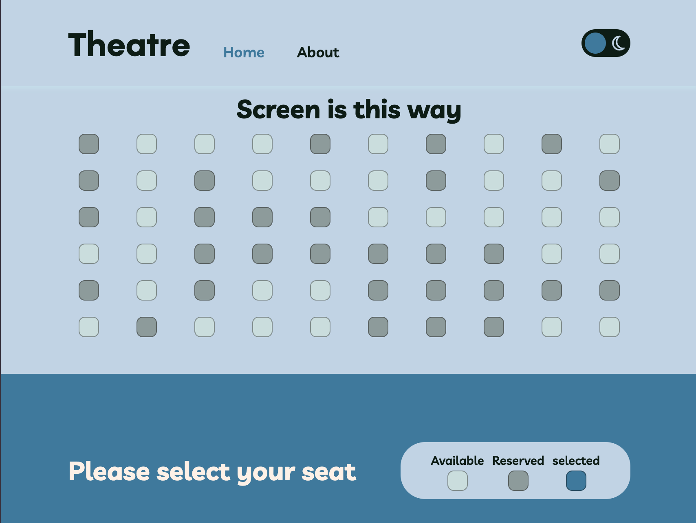

# 🎭 Mini Theatre Booking System

Welcome to the Mini Theatre Booking System! This application allows you to choose and book your seat for a theatre show directly through a simple, intuitive interface. Built with React and SASS, it's designed to provide a seamless booking experience. Responsive design ensures that the app looks great on all devices, from desktops to mobile phones.

## 📌 Overview of Interface

Check out the live version of the app here:
[Visit Mini Theatre](https://mormarzan.github.io/theatre/)





## 🛠 Built With

- **React** - A powerful JavaScript library for building user interfaces.
- **SASS** - An extension of CSS that adds power and elegance to the basic language.

## 🚀 Getting Started

These instructions will get you a copy of the project up and running on your local machine for development and testing purposes.

### Prerequisites

Before you begin, ensure you have the following installed:
- Node.js: [Download & Install Node.js](https://nodejs.org/en/download/) and the npm package manager.

### Installation

To set up the project locally, follow these steps:

1. **Clone the Repository**

   ```bash
   git clone https://github.com/your_username_/theatre.git
   cd theatre

2. **Install Dependencies**

```sh
npm install
```

3. **Run the Application**

```sh
npm run dev
```

### 💡 Contact
For any queries, you can reach us at mormarzan@gmail.com

### 📝 License
This project is licensed under the MIT License - see the LICENSE.md file for details.

### 🤝 Contributing
Contributions are what make the open source community such a fantastic place to learn, inspire, and create. Any contributions you make are greatly appreciated.

Fork the Project
Create your Feature Branch (git checkout -b feature/AmazingFeature)
Commit your Changes (git commit -m 'Add some AmazingFeature')
Push to the Branch (git push origin feature/AmazingFeature)
Open a Pull Request
